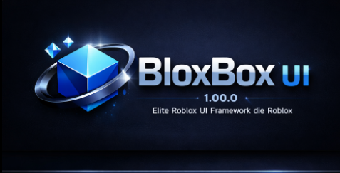

# 💎 BloxBox UI - v1.02.0 (Elite Luau Edition)



**BloxBox UI** es una librería premium de interfaz de usuario para Roblox, optimizada para **Luau** y diseñada para desarrolladores que buscan un estándar profesional, modular y estéticamente superior.

## 🌟 Características Destacadas

- **Estética SaaS Premium**: Diseño oscuro minimalista, bordes redondeados y tipografía moderna.
- **Animaciones Fluidas**: Pantalla de carga (Intro) y micro-interacciones de alta calidad.
- **Sistema de Notificaciones**: Toasts inteligentes con stack automático y barras de progreso.
- **Búsqueda Instantánea**: Encuentra componentes rápidamente con el motor de búsqueda integrado.
- **Arquitectura Modular**: Código transparente, seguro y fácil de auditar.
- **Luau Strict**: Tipado estático para evitar errores y mejorar el IntelliSense.

## 📸 Galería Visual (Showcase)

| **Dashboard Principal** - **Componentes Elite** - **Notificaciones SaaS** |
|  |

> [!TIP]
> **BloxBox UI** utiliza un sistema de renderizado lento (Lazy Rendering) para asegurar que tu juego no pierda FPS al abrir el menú.

---

## 🚀 Instalación Instantánea (One-Line Loader)

Para usar **BloxBox UI** sin tener que descargar archivos manualmente, copia y pega este código en tu script de Roblox (Executor):

```lua
local BloxBox = loadstring(game:HttpGet("https://raw.githubusercontent.com/Sam123mir/BloxBox-UI/master/Loader.lua"))()

local UI = BloxBox.new()
UI:ShowIntro()
```

---

## 📖 Documentación y API

Nuestra documentación detallada se encuentra en el archivo [DOCUMENTATION.md](UIFramework/DOCUMENTATION.md). Allí encontrarás:
- Cómo crear **Pestañas** y **Secciones**.
- Uso del **Motor de Búsqueda** integrado.
- Configuración de **Keybinds** y **Sliders**.
- Guardado y carga de configuraciones JSON.

---

## 🤝 Créditos y Contribuciones

Desarrollado con pasión por **Samir & Team**. BloxBox UI es un proyecto abierto para la comunidad. Si encuentras un bug o tienes una sugerencia, ¡siéntete libre de abrir un Issue o Pull Request!

---

*BloxBox UI - Elevating the Roblox UI Standards.*
